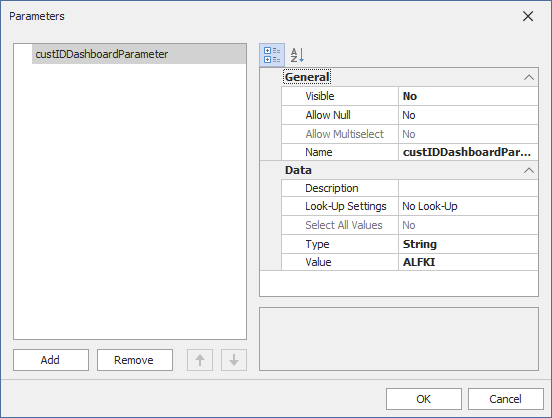
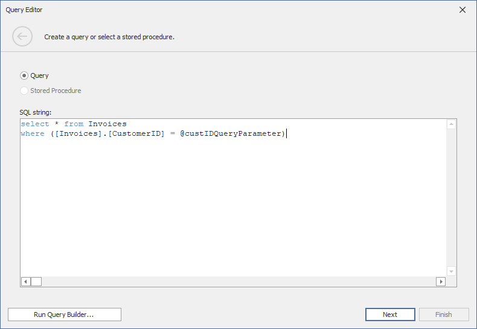
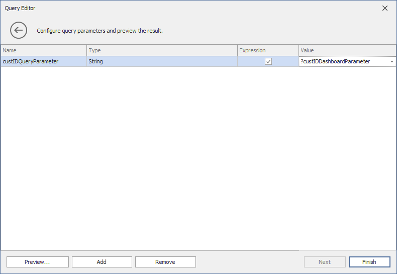

<!-- default badges list -->
[](https://supportcenter.devexpress.com/ticket/details/T338459)
[](https://docs.devexpress.com/GeneralInformation/403183)
<!-- default badges end -->
# Dashboard for WinForms - How to Pass a Hidden Dashboard Parameter to a Custom SQL query

This example shows how to pass a hidden [dashboard parameter](https://docs.devexpress.com/Dashboard/16169) to a [custom SQL query](https://docs.devexpress.com/Dashboard/115212). In this example, the[`DashboardViewer.CustomParameters`](https://docs.devexpress.com/Dashboard/DevExpress.DashboardWin.DashboardViewer.CustomParameters) is handled to change the dashboard parameter's default value before it is passed to the query. 

## Example Overview

To pass a hidden dashboard parameter to a custom SQL query, do the following.

### Create a Dashboard Parameter

In the [Dashboard Designer](https://docs.devexpress.com/Dashboard/117006/), create a [dashboard parameter](https://docs.devexpress.com/Dashboard/16169/). 

Click the **Parameters** button from the **Dashboard** page group on the **Ribbon**'s **Home** page. Click **Add** to create a dashboard parameter. Diasble the [Visible](https://docs.devexpress.com/Dashboard/DevExpress.DashboardCommon.DashboardParameter.Visible) property to hide the parameter from the **Dashboard Parameters** dialog. In this example, the dashboard parameter's name is **custIDDashboardParameter** and its default value is *ALFKI*:



### Create a Custom Query

Custom SQL queries are disabled by default. To allow users to specify custom SQL queries in the [Query Builder](https://docs.devexpress.com/Dashboard/16152)/[Query Editor](https://docs.devexpress.com/Dashboard/115206), set the [`SqlWizardSettings.EnableCustomSql`](https://docs.devexpress.com/Dashboard/DevExpress.DataAccess.UI.Wizard.SqlWizardSettings.EnableCustomSql) property exposed by the [`DashboardDataSourceWizardSettings`](https://docs.devexpress.com/Dashboard/DevExpress.DashboardWin.DashboardDataSourceWizardSettings) class to `true`. Add the following code to allow custom SQL queries:
 
```csharp
dashboardDesigner1.DataSourceWizard.SqlWizardSettings.EnableCustomSql = true;
```

Specify the query in the **SQL string** editor in [Query Builder](https://docs.devexpress.com/Dashboard/16152)/[Query Editor](https://docs.devexpress.com/Dashboard/115206):



This query contains a [query parameter](https://docs.devexpress.com/Dashboard/113947) named **custIDQueryParameter**.


### Bind the Query Parameter to the Dashboard Parameter

To change the query parameter value dynamically, bind it to the **custIDDashboardParameter** dashboard parameter. To do this, on the next page of the **Query Editor**, click **Add** to create a query parameter. Specify the parameter [settings](https://docs.devexpress.com/Dashboard/16169/). In the **Name** column, specify the name used in the query. Select the **Expression** check box and bind the query parameter to the dashboard parameter:



Click **Finish**.

### Change the Default Parameter Value in Code (Dashboard Viewer)

[Load](https://docs.devexpress.com/Dashboard/16913/) the created dashboard to the [Dashboard Viewer](https://docs.devexpress.com/Dashboard/117122/).

Handle the [`DashboardViewer.CustomParameters`](https://docs.devexpress.com/Dashboard/DevExpress.DashboardWin.DashboardViewer.CustomParameters) event and specify the value to be passed to the query: [Form1.cs](./CS/Dashboard_CustomParameters_Win/Form1.cs) (VB: [Form1.vb](./VB/Dashboard_CustomParameters_Win/Form1.vb)).

As the result, a user sees a dashboard based on the data from the SQL query with the **custIDQueryParameter** query parameter's value specified in the `DashboardViewer.CustomParameters` event handler (*AROUT*).


## Files to Review

* [Form1.cs](./CS/Dashboard_CustomParameters_Win/Form1.cs) (VB: [Form1.vb](./VB/Dashboard_CustomParameters_Win/Form1.vb))

## Documentation

- [Dashboard Parameters](https://docs.devexpress.com/Dashboard/116918)
- [Specify Dashboard Parameter Values in the Dashboard Viewer](https://docs.devexpress.com/Dashboard/17632/winforms-dashboard/winforms-viewer/manage-dashboard-parameters)
- [Reference Dashboard Parameters](https://docs.devexpress.com/Dashboard/16170)


## More Examples

* [Dashboard for WinForms - Pass a Dashboard Parameter to a Filter String in Code](https://github.com/DevExpress-Examples/how-to-pass-a-dashboard-parameter-to-a-filter-string-in-code-e5117)
* [Dashboard for WinForms - Pass a Dashboard Parameter to a Calculated Field's Expression in Code](https://github.com/DevExpress-Examples/how-to-pass-a-dashboard-parameter-to-a-calculated-fields-expression-in-code-e5135)
* [Dashboard for WinForms - Pass a Dashboard Parameter to a Custom SQL Query in Code](https://github.com/DevExpress-Examples/how-to-pass-a-dashboard-parameter-to-a-custom-sql-query-in-code-e5120)
* [Dashboard for WinForms - Specify Default Parameter Values in the WinForms Viewer](https://github.com/DevExpress-Examples/how-to-specify-default-parameter-values-in-the-winforms-viewer-t475858)
* [Dashboard for WinForms - Use Dashboard Parameters with the Expression Format Condition](https://github.com/DevExpress-Examples/how-to-usedashboard-parameters-with-the-expressionformat-condition-t260065)
* [Dashboard for WinForms - Manage Parameters in the WinForms Viewer](https://github.com/DevExpress-Examples/winforms-dashboard-how-to-manage-dashboard-parameters-in-code-t635871)
* [Dashboard for WinForms - Display the Others Slice in the Pie Chart](https://github.com/DevExpress-Examples/how-to-display-pie-chart-others-slice)
